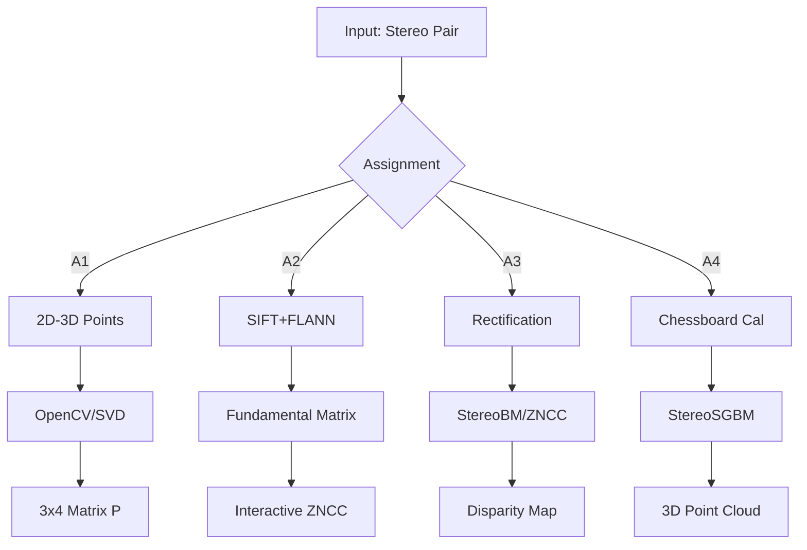

# Stereo Vision & 3D Reconstruction Pipeline

[](https://www.python.org/)
[](https://opencv.org/)
[](LICENSE)
[](https://colab.research.google.com/)

*End-to-end stereo vision system: from camera calibration to dense 3D point-cloud reconstruction*

---

## At-a-Glance: Assignment Overview

| # | Topic | Key Goal | Main Metric/Output |
|---|-------|----------|-------------------|
| **1** | Camera Calibration | Compute 3×4 projection matrix from 2D-3D correspondences | Average pixel reprojection error |
| **2** | Epipolar Geometry & Sparse Matching | Interactive pixel correspondence via fundamental matrix and ZNCC | ZNCC similarity score; epipolar line validation |
| **3** | Dense Stereo Matching | Generate full disparity maps (StereoBM vs. custom ZNCC) | Disparity map quality; processing time |
| **4** | 3D Reconstruction | Full metric point-cloud from calibrated stereo pair | 3D point count; visual fidelity |

---

## Assignment 1: Camera Calibration

### Problem Statement
Estimate the camera projection matrix P ∈ ℝ³ˣ⁴ that maps 3D world coordinates to 2D image coordinates using two approaches:
1. OpenCV's `calibrateCamera` with nonlinear optimization
2. Direct Linear Transform (DLT) via SVD

### Key Algorithm
- **OpenCV Method:** Initialize camera matrix with f=1000, use `CALIB_USE_INTRINSIC_GUESS` flag
- **SVD Method:** Construct 2n×12 matrix A, solve via `np.linalg.svd(A)`

### Main Scripts
```bash
python src/assignment_1/opencv_calibration.py --input_3d data/sample_calibration/3D.txt --input_2d data/sample_calibration/2D.txt
python src/assignment_1/svd_calibration.py --input_3d data/sample_calibration/3D.txt --input_2d data/sample_calibration/2D.txt
```

---

## Assignment 2: Pixel Matching & Epipolar Geometry

### Problem Statement
Build an interactive interface that loads a stereo pair, computes fundamental matrix F, allows user to click a pixel in the left image, then:
- Draws the epipolar line in the right image
- Finds best-matching pixel via ZNCC sliding window

### Key Algorithm
1. SIFT feature detection + FLANN matching with Lowe's ratio test (0.7)
2. RANSAC fundamental matrix estimation (threshold: 3.0 pixels)
3. ZNCC sliding window along epipolar line (±50 pixel search range)

### Main Script
```bash
python src/assignment_2/epipolar_matcher.py
# Or run in Google Colab for interactive UI
```

---

## Assignment 3: Dense Stereo Matching

### Problem Statement
Perform dense matching for all pixels using two methods:
1. **VP-3.1:** OpenCV's StereoBM with optimized parameters
2. **VP-3.2:** Custom ZNCC with edge detection and interpolation

### Key Algorithms
- **StereoBM:** numDisparities=128, blockSize=7, uniquenessRatio=15
- **ZNCC Edge:** Canny edge detection → ZNCC match → linear interpolation

### Main Scripts
```bash
python src/assignment_3/stereo_bm.py
python src/assignment_3/zncc_edge_matcher.py
```

---

## Assignment 4: 3D Reconstruction from Stereo Pair

### Problem Statement
Full 3D point-cloud reconstruction pipeline:
1. Chessboard calibration (11×7 corners)
2. Stereo calibration (intrinsic + extrinsic parameters)
3. StereoSGBM dense matching
4. 3D reprojection with RGB texture mapping
5. Plotly interactive visualization

### Main Script
```bash
python src/assignment_4/reconstruction_3d.py
```

---

## Quick Start

### Installation
```bash
git clone https://github.com/IShauryaI/stereo-vision-reconstruction.git
cd stereo-vision-reconstruction
pip install -r requirements.txt
```

### Running Examples
See individual assignment sections above for specific commands.

---

## Architecture



---

## Roadmap

- [ ] Unit tests with pytest (80% coverage target)
- [ ] Streamlit web app for browser-based demos
- [ ] Docker container for reproducibility
- [ ] GitHub Actions CI/CD pipeline
- [ ] Benchmark results on Middlebury/KITTI datasets
- [ ] GPU acceleration via CUDA

---

## License

This project is licensed under the MIT License - see the [LICENSE](LICENSE) file for details.

---

## Acknowledgments

- **OpenCV Community** for robust computer vision algorithms
- **Google Colab** for free GPU-accelerated environments
- **Middlebury Stereo Dataset** for benchmark images

---

<p align="center">
  <strong>Built for Computer Vision Research & Education</strong>
</p>